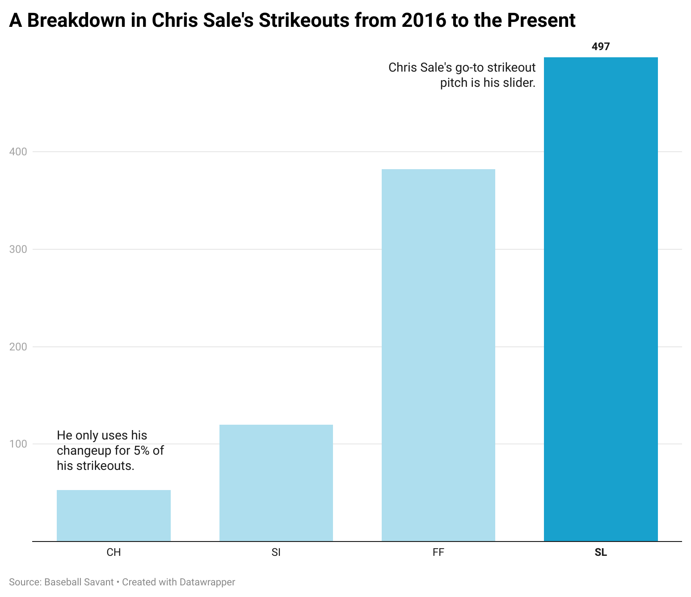
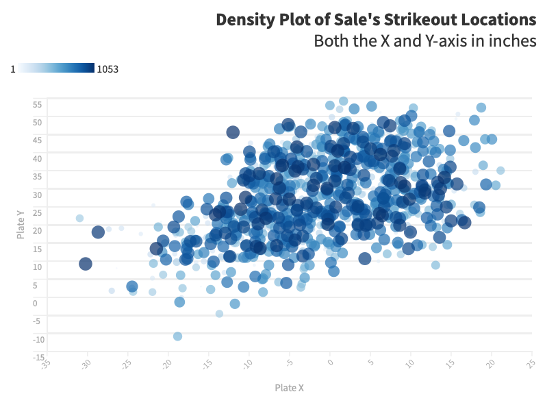

I pledge my honor that I have abided by the Stevens Honor System.

```{r setup, include=FALSE}
knitr::opts_chunk$set(echo = FALSE)
```

<div style="margin-bottom:150px;">
</div>


# Criteria 1: Tool Evaluation

## Datawrapper


### <span style="color: grey;">Why?</span>

I chose my first tool evaluation because this is a very high level way of creating complex data visualizations. The user interface is very easy to understand and it does not requre the user to have any programming knowledge in order to create them.

Changing the type of plot is as easy as pressing a button and it does a good job of helping out with annotations. It does most things automatically.


### <span style="color: grey;">Negatives</span>

While this is a great tool for most people, it only offers a handful of plots. If you need a niche plot such as their arrow plot it would help, but if you are looking to do something that they do not offer you are out of luck.

If you need a heavier level of customization it would make sense to use something else. The plots that they make seem to be robust to different types of data but whatever is made is made.

### <span style="color: grey;">Usefulness</span>

This seems like this is a great tool for beginners. It is easy to make good looking visualiations and it is easy to highlight data; however, it is somewhat limited in its capabilities.

## Flourish

{#id .class width=40% height=40%}

### <span style="color: grey;">Why?</span>

This online tool is good for creating entire story lines with the data. It reminds me of Tableau in the way that you can embed maps, and this one you can do in many different ways. You can also develop an entire data-driven story using just this software.

This seems to offer many more types of visualizations when compared to Datawrapper, so it seems like this offers a greater amount of customization. It also allows you to create your own visualizations through the use of their SDK or API so it seems to cater to a larger amount of people (depending on skill level).

### <span style="color: grey;">Negatives</span>

One of the negatives of this tool is that it is not as intuitive as Datawrapper to use. It seems like it is a little more advanced and does not work as robustly/seamlessly. It is still easier to use than a barebones application/ building plots from the ground up in something like ggplot or Matplotlib, but it still requires more user input.

### <span style="color: grey;">Usefulness</span>

This is something that is especially useful for someone that is not a complete beginner, but still someone that does not want to create an entire visualization from scratch using a package in a programming language. It seems like it is a happy medium that provides a high level take on data visualization while still offering vast customization options.

It is also helpful to developers that may want to build off of their existing plots and offer even more through the use of their SDK. It is geared toward the intermediate-to-advanced section of people.

## Plotly

{#id .class width=50% height=50%}


### <span style="color: grey;">Why?</span>

Plotly (specifically Dash) is a low code visualization library for programming languages such as Python, R, Julia, etc. This is a library that is easier to make complex web-based visualizations when compared to something such as Matplotlib or ggplot. It is open source with many contributors so it is constantly being updated with new features and the like. 

It also has no code solutions (Chart Studio) that is easier for creating these visualizations. They have a couple map visuals, 3D plots, and some other niche visuals that would be hard to code from the ground up in R, Python, or even Tableau.


### <span style="color: grey;">Negatives</span>

One thing about Plotly's Chart Studio application is that many of the charts that they offer seem to be barebones and simplistic plots. They would be very easy to do in a programming language even for someone that is a beginner. For those reasons it is not the greatest option to pick for a no code visualization solution.

### <span style="color: grey;">Usefulness</span>

This is used best if you were to need a specific plot that Plotly does well. Many of their 3D plots would be hard to get right using other solutions, so that would be a good use case if for some reason you need to for example visualize the gradient of a certain function, or something like that.

<div style="margin-bottom:150px;">
</div>

# Criteria 2: Usage Pattern

## Tools Selected: Infogram and Datawrapper

These two tools can use used together, mainly using Infogram to introduce the data set and present it in a different way as opposed to traditional data visualization techniques. After, Datawrapper can be used for a more complex and in-depth analysis of the certain points that the author is trying to make.

For example, let's say that the author is looking at data regarding the amount of people that live alone, with roommates, with significant others, or with families. They could introduce that with different sized house outlines representing different percentages. It is a cartoony way of showing the major points in the data set. After, they would transition into some of Datawrapper's visualizations to further illustrate the point.
<div style="margin-bottom:150px;">
</div>

# Criteria 3: Application

## Dataset: Chris Sale Strikeouts from 2016 to present

### Why this dataset?

I decided to pick this data set because I have a deep interest in baseball. I am a collegiate pitcher and have looked up to Chris Sale specifically for a while now, so I think it would be interesting to take a look at some of his strikeout statistics.

## Tools

I have decided to use Datawrapper and Flourish.

## Visualizations

First we will look at his strikeouts by pitch type. You can see that the most strikeouts are by his slider, which is not surprising considering that it is one of the best in the league. He almost has more slider strikeouts than fastball strikeouts if you count sinkers as fastballs as well. It makes sense that he would throw his best pitch in strikeout counts.



The next plot is the location of his strikeouts made with Flourish. You can see that the most are either up and in, or down and away. Because of his slider moving in the exact direction of the trendline, it make sense that a fastball up and in could be tunneled with a slider down and away. The majority of strikeouts following this pattern works.




